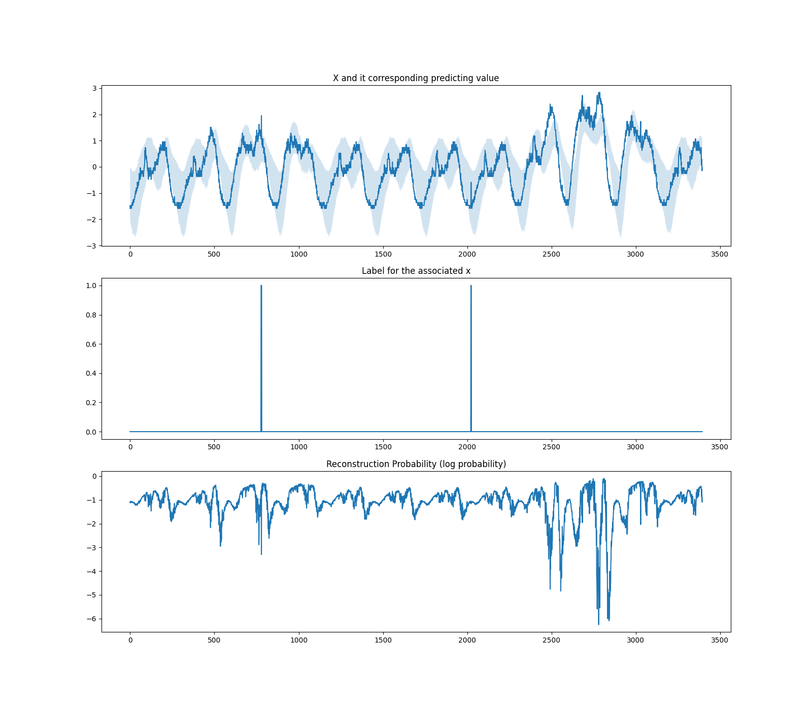
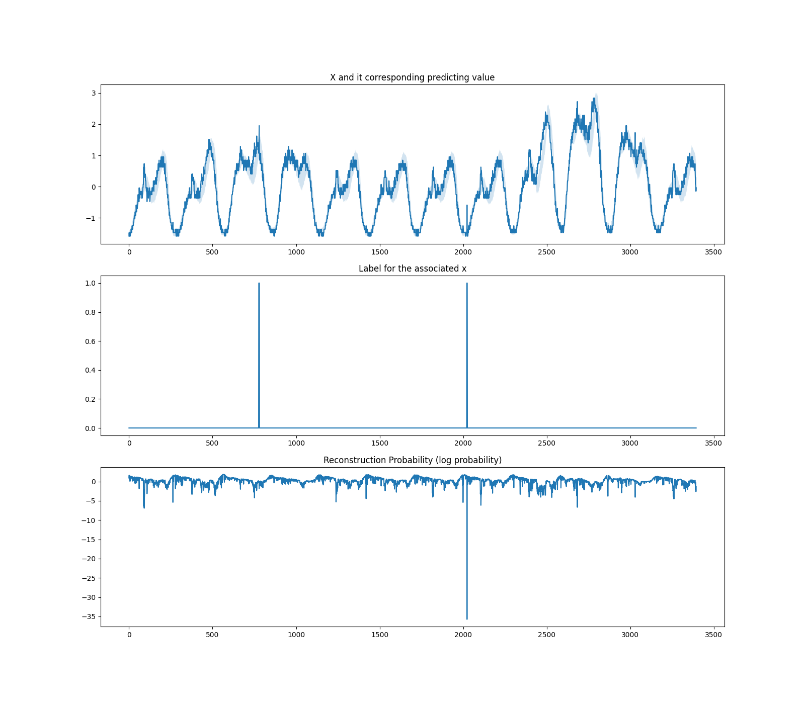
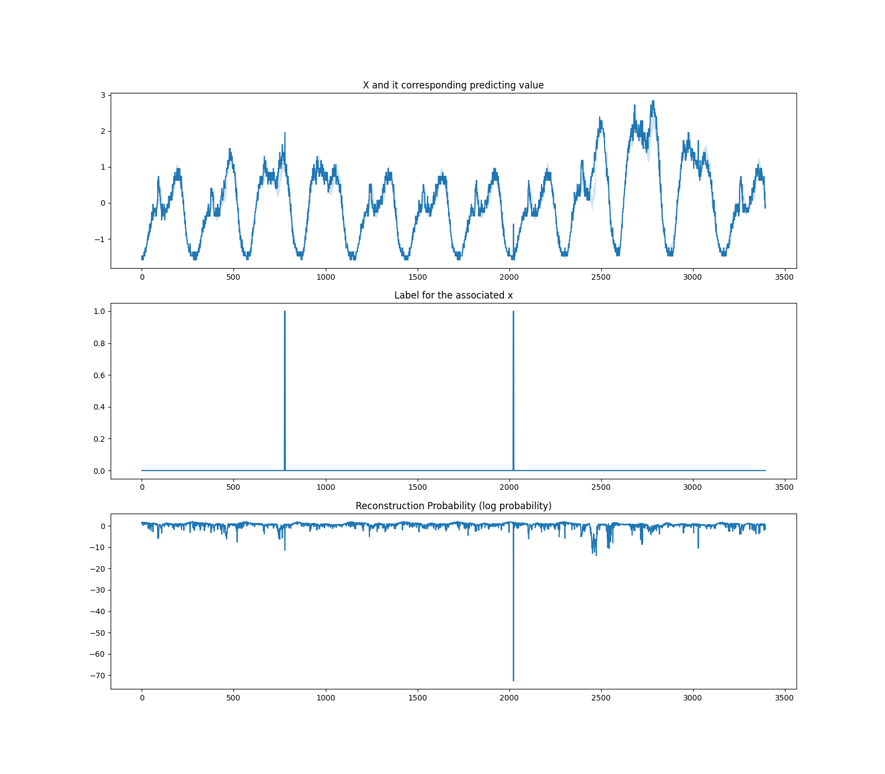
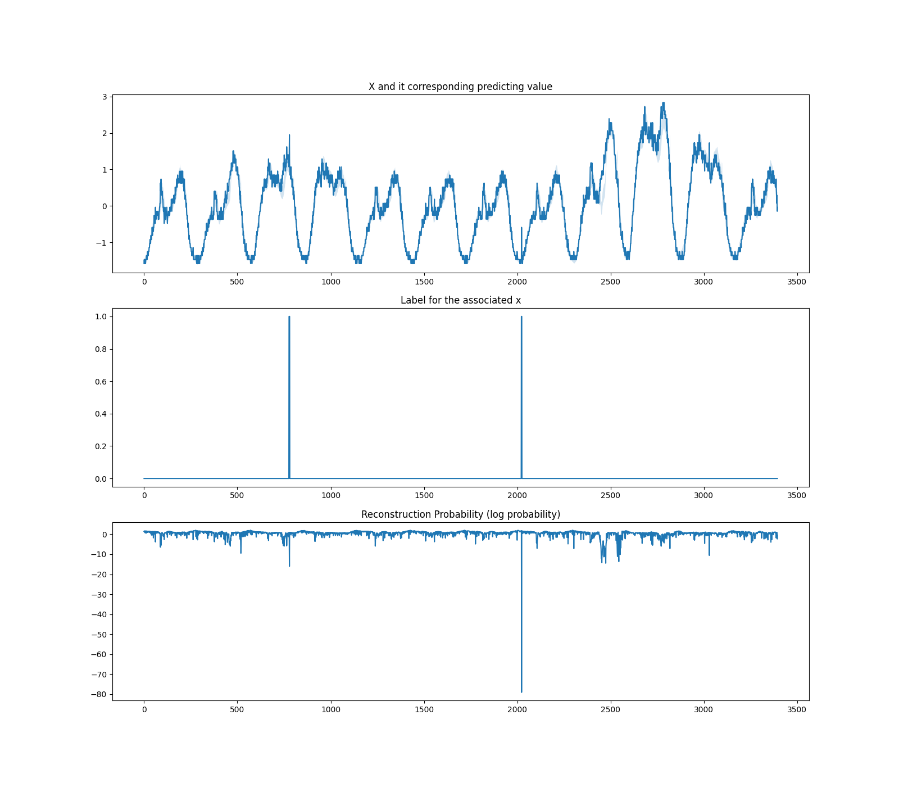

✨ Am implement for [Donut](ttps://github.com/NetManAIOps/donut), a univariate time series anomaly detection algorithm,  with pytorch .✨ Reference to [flower-kyo/pytorch-donut](https://github.com/flower-kyo/pytorch-donut).

## Introduction
We use the `cpu4.csv` in [NetManAIOps/donut](https://github.com/NetManAIOps/donut/tree/master/sample_data) as a test dataset. The result in different epochs are as follows:

1 epoch:

10 epochs:

100 epochs:

250 epochs:

## Installation and runing
1. Clone this repository
2. cd pytorch-donut   
2. `python main.py`

